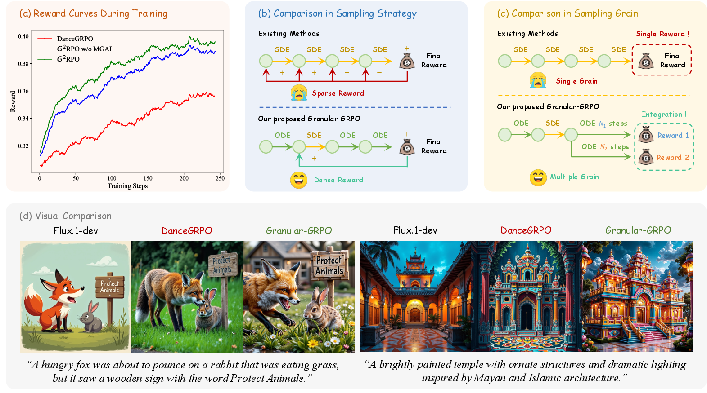

# Granular-GRPO

<details><summary>Click for the full abstract</summary>

> The integration of online reinforcement learning (RL) into diffusion and flow models has recently emerged as a promising approach for aligning generative models with human preferences. Stochastic sampling via Stochastic Differential Equations (SDE) is employed during the denoising process to generate diverse denoising directions for RL exploration. While existing methods effectively explore potential high-value samples, they suffer from sub-optimal preference alignment due to sparse and narrow reward signals. To address these challenges, we propose a novel **G**ranular-**GRPO** (G²RPO) framework that achieves precise and comprehensive reward assessments of sampling directions in reinforcement learning of flow models. Specifically, a *Singular Stochastic Sampling* strategy is introduced to support step-wise stochastic exploration while enforcing a high correlation between the reward and the injected noise, thereby facilitating a faithful reward for each SDE perturbation. Concurrently, to eliminate the bias inherent in fixed-granularity denoising, we introduce a *Multi-Granularity Advantage Integration* module that aggregates advantages computed at multiple diffusion scales, producing a more comprehensive and robust evaluation of the sampling directions. Experiments conducted on various reward models, including both in-domain and out-of-domain evaluations, demonstrate that our G²RPO significantly outperforms existing flow-based GRPO baselines, highlighting its effectiveness and robustness.
</details>

**[G²RPO: Granular GRPO for Precise Reward in Flow Models]()** 
</br>
[Yujie Zhou*](https://github.com/YujieOuO/),
[Pengyang Ling*](https://github.com/LPengYang/),
[Jiazi Bu*](https://bujiazi.github.io/),
[Yibin Wang](https://codegoat24.github.io/),
[Yuhang Zang](https://yuhangzang.github.io/),
[Jiaqi Wang<sup>†</sup>](https://myownskyw7.github.io/),
[Li Niu<sup>†</sup>](https://www.ustcnewly.com/),
[Guangtao Zhai](https://faculty.sjtu.edu.cn/zhaiguangtao/en/index.htm/)

(*Equal Contribution)(<sup>†</sup>Corresponding Author)

[](https://arxiv.org/abs/2510.01982)
[](https://bujiazi.github.io/g2rpo.github.io/)
[](https://github.com/bcmi/Granular-GRPO)

## 📜 News

**[2025/10/3]** Code is available now!

**[2025/10/2]** The paper and project page have been released!

## 🏗️ Todo
- [ ] Release a gradio demo.

## 📚 Gallery
We show more results in the [Project Page](https://bujiazi.github.io/g2rpo.github.io/).

## 🚀 Method Overview

<div align="center">
    
</div>
Granular-GRPO: an online RL framework for precise and comprehensive reward assessments.

## 🔧 Installations

### Setup repository and conda environment

```bash
git clone https://github.com/bcmi/Granular-GRPO.git
cd Granular-GRPO

conda create -n g2rpo python=3.10
conda activate g2rpo

bash env_setup.sh

git clone https://github.com/tgxs002/HPSv2.git
cd HPSv2
pip install -e . 
cd ..
```

The environment dependency is the same as [DanceGRPO](https://github.com/XueZeyue/DanceGRPO).

## 🔑 Model Preparations

### 1. FLUX
```bash
# Download the FLUX.1-dev model.
mkdir ./ckpt/flux
huggingface-cli login
huggingface-cli download --resume-download  black-forest-labs/FLUX.1-dev --local-dir ./ckpt/flux
```

### 2. Reward Models

#### HPS-v2.1
```bash
# Download the HPS reward model.
python scripts/huggingface/download_hf.py --repo_id xswu/HPSv2 --local_dir ./ckpt/hps

# Download the CLIP-ViT-H-14-laion2B-s32B-b79K.
python scripts/huggingface/download_hf.py --repo_id laion/CLIP-ViT-H-14-laion2B-s32B-b79K --local_dir ./ckpt/CLIP-ViT-H-14-laion2B-s32B-b79K
```

#### CLIP_Score
```bash
# Download the CLIP_Score reward model.
python scripts/huggingface/download_hf.py --repo_id apple/DFN5B-CLIP-ViT-H-14 --local_dir ./ckpt/clip_score
```

## 🎈 Quick Start

### Preprocess Data
```bash
# Obtain the embeddings of the prompt dataset.
bash scripts/preprocess/preprocess_flux_rl_embeddings.sh
```

### Training
```bash
# Training with 16 GPUs for hps reward.
bash scripts/finetune/finetune_g2rpo_hps.sh

# Training with 16 GPUs for hps and clip_score reward.
bash scripts/finetune/finetune_g2rpo_hps_clip.sh
```

### Inference
We provide our G2RPO ckpt at [Huggingface](https://huggingface.co/yujieouo/G2RPO)
```bash
# Download the G2RPO ckpt
mkdir ./ckpt/g2rpo
huggingface-cli login
huggingface-cli download --resume-download yujieouo/G2RPO diffusion_pytorch_model.safetensors --local-dir ./ckpt/g2rpo

# inference
python scripts/inference/infer.py
```

## 📎 Citation 
If you find our work helpful for your research, please consider giving a star ⭐ and citation 📝 
```bibtex
@article{zhou2025g2rpo,
  title={G$^2$RPO: Granular GRPO for Precise Reward in Flow Models},
  author={Zhou, Yujie and Ling, Pengyang and Bu, Jiazi and Wang, Yibin and Zang, Yuhang and Wang, Jiaqi and Niu, Li and Zhai, Guangtao},
  journal={arXiv preprint arXiv:2510.01982},
  year={2025}
}
```

## 💞 Acknowledgement
The code is built upon the below repositories, we thank all the contributors for open-sourcing.

* [DanceGRPO](https://github.com/XueZeyue/DanceGRPO)
* [Flow-GRPO](https://github.com/yifan123/flow_grpo)
* [MixGRPO](https://github.com/Tencent-Hunyuan/MixGRPO)
* [FastVideo](https://github.com/hao-ai-lab/FastVideo)
* [DDPO](https://github.com/kvablack/ddpo-pytorch)
